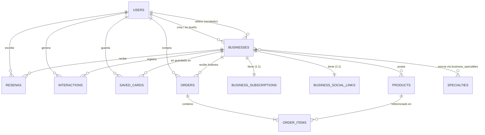
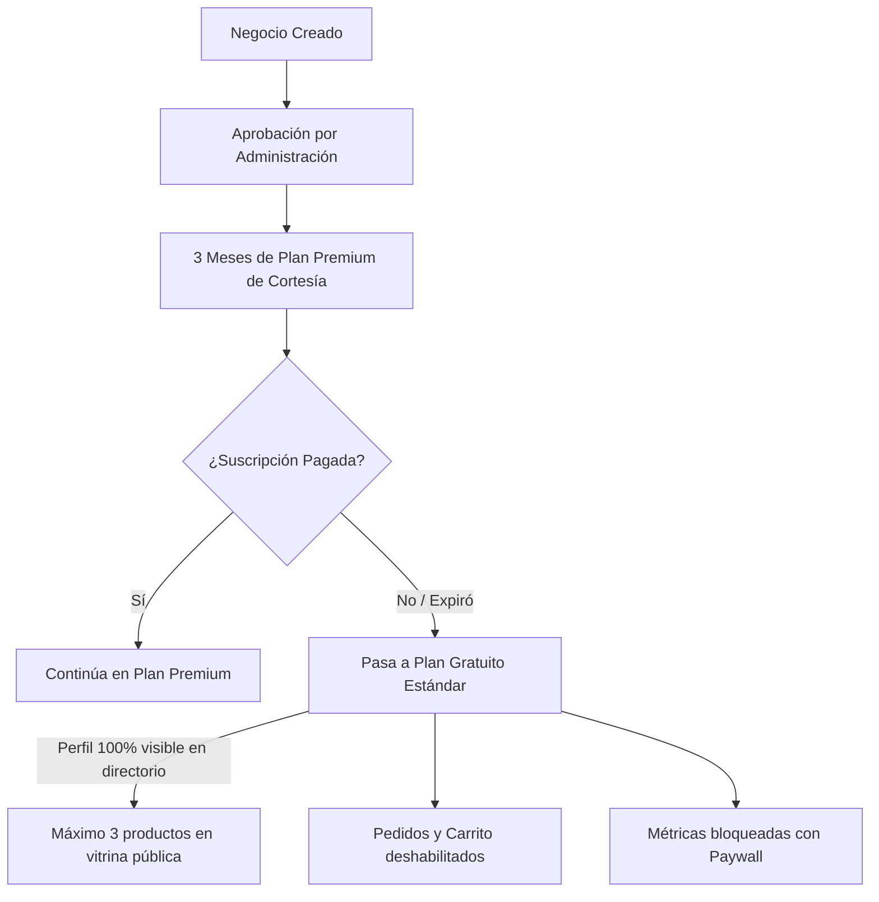

# Documentación Técnica y Arquitectura del Proyecto "Tarjetoso"

> **Convención de rutas:** Ambos repositorios (`spinjob-fronted/` y `spinjob-backend/`) deben estar como carpetas hermanas dentro de un mismo directorio padre.
> ```
> <carpeta-padre>/
> ├── spinjob-fronted/    ← Repositorio Frontend (React 19 + Vite + Tailwind CSS 4)
> └── spinjob-backend/    ← Repositorio Backend (FastAPI + SQLAlchemy + PostgreSQL)
> ```

---

## 1. Resumen del Proyecto
**Tarjetoso** es una plataforma web progresiva (PWA) de directorio comercial, servicios y profesionales independientes enfocada inicialmente en Bolivia y con soporte multi-país. Permite a profesionales, comercios y emprendedores crear "tarjetas digitales" interactivas y públicas, recibir reseñas, exhibir sus vías de contacto (redes sociales, WhatsApp, llamadas, geolocalización) y ser descubiertos mediante un buscador inteligente con filtros avanzados (categoría, subcategoría, departamento, calificación, distancia).

El proyecto integra:
1. **Plantilla Premium Unificada (`src/plantillas/PlantillaGenerica.jsx`):** Con soporte de **Modo Edición Inline**, permitiendo al dueño modificar datos generales, biografía, redes sociales, especialidades, ubicación en mapa y catálogo de productos en tiempo real sobre la misma tarjeta.
2. **Catálogo de Productos & Vitrina Digital:** Carrusel interactivo embebido en el perfil con soporte de secciones (`carousel_name`), control de stock, visibilidad individual y gestión CRUD directa.
3. **Sistema de Pedidos (Shopping Cart & Checkout Nativo):** Carrito de compras interactivo con soporte de envíos (retiro en punto aliado, entrega a domicilio, envíos nacionales), pago QR con subida de comprobantes y panel de gestión de pedidos para el vendedor (`/mis-pedidos/:slug`) y cliente (`/mis-compras`).
4. **Dashboard de Métricas y Analítica:** Panel de analítica en tiempo real (`/metricas/:slug`) con gráficos interactivos de visitas, clics en redes y conversiones por WhatsApp/llamadas.
5. **Panel de Administración y Vendedores (`/admin`):** Gestión modular de moderación de negocios (aprobar/rechazar con motivos), usuarios, especialidades (categorías/subcategorías), países y estados, métricas globales con exportación PDF y flujo de vendedores/afiliados con transferencia manual de comercios.
6. **Sistema de Monetización Freemium/Premium:** Plan Gratuito permanente vs Plan Premium con beneficios exclusivos (catálogo ampliado de hasta 50 productos con 15 visibles, 600 pedidos/mes, analítica avanzada, insignia de verificado y 3 meses de bienvenida automática al aprobarse).

---

## 2. Stack Tecnológico

### Frontend
- **Framework & Core:** React 19.2 (`react`, `react-dom`), Vite 8.0.
- **Estilos & UI:** Tailwind CSS 4.2 (`@tailwindcss/vite`), Lucide React (iconografía moderna), Glassmorphism y diseño responsivo adaptativo.
- **Enrutamiento:** React Router DOM 7.13 (SPA con Lazy Loading y Splash Screen nativo).
- **SEO Dinámico:** `react-helmet-async` (meta-tags Open Graph, Twitter Cards, Schema.org JSON-LD).
- **Gráficos & Visualización:** `recharts` 3.8 (gráficos de analítica e interacción).
- **Herramientas & Medios:**
  - `react-easy-crop` (recorte interactivo de avatares circulares e imágenes de catálogo rectangulares).
  - `qrcode.react` (generación y descarga de códigos QR vectoriales de alta resolución).
  - `jspdf` + `jspdf-autotable` (exportación de reportes ejecutivos de analítica en PDF).
- **PWA & Offline:** `vite-plugin-pwa` (Service Worker con Workbox, cacheo NetworkFirst/CacheFirst y prompts personalizados).
- **Autenticación Cliente:** `@react-oauth/google` (Google Identity Services GSI).

### Backend
- **Framework:** Python 3.14, FastAPI (arquitectura modular Router-Service-Model).
- **ORM & Base de Datos:** SQLAlchemy 2.0, PostgreSQL alojado en **Neon DB** (Serverless PostgreSQL), `psycopg2-binary`.
- **Migraciones:** Alembic 1.13 (control de versiones del esquema relacional).
- **Almacenamiento de Medios:** Cloudinary SDK (gestión organizada de imágenes en carpetas dinámicas por negocio y producto).
- **Autenticación & Seguridad:** JWT (`PyJWT`), `bcrypt` para hashing, `google-auth` para validación de tokens OAuth2 de Google, SMTP nativo con códigos OTP de 6 dígitos.
- **Zona Horaria & Fechas:** `pytz` (soporte de zonas horarias locales como `America/La_Paz`).

### Infraestructura & Despliegue
- **Frontend:** Vercel (Single Page Application con reglas de rewrite para `/api/*`, `/sitemap.xml`, `/og/*`, `/seo/perfil/*`).
- **Backend:** Docker en Oracle Cloud Infrastructure Free Tier (ARM64, 2 OCPUs, 12 GB RAM). Contenedor con `restart: unless-stopped` para auto-recuperación.
- **Contenedorización:** Docker + Docker Compose para desarrollo local y producción. Deploy automatizado con `deploy.sh` (un solo comando desde la máquina local).
- **Backups:** Script automatizado de copias de seguridad de PostgreSQL hacia Google Drive (`backup_to_drive.py` vía `pg_dump` y Google Drive API).

---

## 3. Arquitectura de la Base de Datos (Modelos SQLAlchemy)

El sistema relacional se estructura en **13 tablas principales** y 1 tabla de asociación Muchos a Muchos (`spinjob-backend/models.py`):



### Detalle de Modelos

1. **Users (`users`):**
   - `id` (String UUID, PK), `email` (Unique, Index), `phone` (Unique, Index), `name`, `verification_code` (OTP SMTP), `is_verified` (Boolean), `is_admin` (Boolean), `is_vendedor` (Boolean), `country` (Default: "Bolivia"), `state` (Departamento/Estado, nullable).
   - Relaciones: `negocios` (propios), `negocios_referidos` (referidos como vendedor), `interacciones`, `resenas`.

2. **Businesses (`businesses`):**
   - **Datos Generales:** `id` (UUID, PK), `name`, `title`, `description` (Text), `image` (URL Cloudinary), `genero` (nullable).
   - **E-E-A-T SEO Fields:** `experience_years` (Integer), `credentials` (String con matrícula/acreditación profesional).
   - **Contacto & Ubicación:** `phone`, `whatsapp_numbers` (JSON array: `["59170000000", "59171111111"]`), `country` (Default "Bolivia"), `state` (Departamento), `home_delivery` (Boolean), `national_delivery` (Boolean), `ubicacion_url` (URL de Google Maps).
   - **Configuración de Pedidos & Logística:** `orders_enabled` (Boolean, default True), `carousel_order` (JSON/String de orden de secciones), `delivery_methods` (JSON array con métodos activos: `["retiro_en_punto", "envio_a_domicilio", "envio_nacional"]`), `qr_payment_url` (URL de imagen QR de pago), `pickup_fee` (Float, tarifa de retiro en punto aliado), `catalog_url` (enlace externo opcional).
   - **Sistema & Estado:** `slug` (Unique, Index), `rating` (Float, promedio), `reviews_count` (Integer), `verified` (Boolean), `status` ("pendiente", "aprobado", "rechazado"), `rejection_reason` (Text), `owner_id` (FK a `users.id`), `referred_by` (FK a `users.id`, vendedor referente).
   - **Propiedades Dinámicas / Proxy:**
     - `category` & `subcategories`: Computadas dinámicamente desde la relación `specialties`.
     - `canonical_url`: URL canónica del perfil (`https://tarjetoso.com/perfil/{slug}`).
     - `json_ld`: Schema.org dinámico (`LocalBusiness` + `BreadcrumbList` jerárquico + `AggregateRating` + `sameAs`).
     - Proxy a `BusinessSocialLinks`: `facebook`, `instagram`, `linkedin`, `website`, `tiktok`, `github`.
     - Proxy a `BusinessSubscription`: `creation_date`, `plan_months`, `expiration_date`, y getter dinámico `premium` (evalúa si `subscription.premium == True` y `expiration_date >= hoy`).

3. **BusinessSocialLinks (`business_social_links`):**
   - Tabla normalizada 1:1 con `businesses`.
   - `id` (UUID, PK), `business_id` (FK `businesses.id`, `ondelete=CASCADE`, Unique).
   - `facebook`, `instagram`, `linkedin`, `website`, `tiktok`, `github`.

4. **BusinessSubscription (`business_subscriptions`):**
   - Tabla normalizada 1:1 con `businesses`.
   - `id` (UUID, PK), `business_id` (FK `businesses.id`, `ondelete=CASCADE`, Unique).
   - `creation_date` (String/Datetime), `plan_months` (Integer), `expiration_date` (String/Datetime), `premium` (Boolean, default False).

5. **Specialties (`specialties`):**
   - Catálogo maestro de categorías y subcategorías.
   - `id` (UUID, PK), `category` (Index), `subcategory`, `source` ("system" o "user_other").
   - Restricción de unicidad: `_category_subcategory_uc` (`category`, `subcategory`).

6. **business_specialties (`business_specialties`):**
   - Tabla intermedia Muchos a Muchos entre `businesses` y `specialties`.
   - `business_id` (FK `businesses.id`), `specialty_id` (FK `specialties.id`).

7. **Locations (`locations`):**
   - Jerarquía geográfica activa de países y departamentos/estados.
   - `id` (UUID, PK), `country` (Index), `state`.
   - Restricción de unicidad: `_country_state_uc` (`country`, `state`).

8. **Products (`products`):**
   - Catálogo de productos y servicios de vitrina.
   - `id` (UUID, PK), `name`, `description` (Text), `price` (String numérico/moneda), `image_url` (Cloudinary), `is_visible` (Boolean, default True), `carousel_name` (String, sección/categoría interna, default "Catálogo"), `stock` (Integer, nullable; `null` = stock infinito, `0` = agotado), `business_id` (FK `businesses.id`, `ondelete=CASCADE`).

9. **Resenas (`resenas`):**
   - Calificaciones y opiniones de usuarios.
   - `id` (UUID, PK), `user_id` (FK `users.id`), `business_id` (FK `businesses.id`), `rating` (Integer 1-5), `descripcion` (Text), `image_url` (Cloudinary, nullable).
   - Restricción de unicidad: `_userid_business_resena_uc` (máximo 1 reseña por usuario por negocio).
   - Propiedad computada: `user_name` (obtenida de la relación con `User`).

10. **Interactions (`interactions`):**
    - Registro de métricas de uso y clics reales.
    - `id` (UUID, PK), `platform` ("perfil_view", "whatsapp", "facebook", "instagram", "tiktok", "linkedin", "github", "website", "telefono", "ubicacion", "compartir", "qr"), `date` (String ISO `YYYY-MM-DD`), `user_id` (FK `users.id`, nullable), `business_id` (FK `businesses.id`).

11. **SavedCards (`saved_cards`):**
    - Tarjetero de tarjetas guardadas en favoritos.
    - `id` (UUID, PK), `user_id` (FK `users.id`), `business_id` (FK `businesses.id`), `saved_date` (String ISO).
    - Restricción de unicidad: `_user_business_saved_uc` (`user_id`, `business_id`).

12. **Orders (`orders`):**
    - Pedidos formalizados por clientes.
    - `id` (UUID, PK), `order_number` (Integer, secuencial por negocio), `user_id` (FK `users.id`), `business_id` (FK `businesses.id`), `customer_name` (String), `status` (Default `"pendiente_de_pago"`; valores: `"pendiente_de_pago"`, `"pagado"`, `"entregado"`, `"cancelado"`), `delivery_method` (String: `"retiro_en_punto"`, `"envio_a_domicilio"`, `"envio_nacional"`), `pickup_business_id` (FK `businesses.id`, nullable), `total_price` (Float), `created_at` (String ISO), `delivered_at` (String ISO, nullable), `receipt_url` (String URL Cloudinary del comprobante QR), `payment_rejection_reason` (Text, nullable).

13. **OrderItems (`order_items`):**
    - Detalle de productos por orden.
    - `id` (UUID, PK), `order_id` (FK `orders.id`, `ondelete=CASCADE`), `product_id` (FK `products.id`, nullable), `product_name` (String histórico), `quantity` (Integer), `price_at_time` (Float), `subtotal` (Float).

---

## 4. Lógica de Negocio y Flujos del Backend (FastAPI)

### 4.1. Arquitectura de Capas (Controller-Service-Model)
El backend implementa Clean Architecture con estricta separación de responsabilidades:
- **Routers (`spinjob-backend/routers/`):** Controladores HTTP puros que definen endpoints, validan esquemas de entrada y delegan toda la lógica a los servicios.
  - `admin.py`, `auth.py`, `businesses.py`, `countries.py`, `orders.py`, `products.py`, `reviews.py`, `seo.py`, `specialties.py`, `tarjetero.py`, `users.py`.
- **Servicios (`spinjob-backend/services/`):** Capa de lógica de negocio, validaciones transaccionales y operaciones de base de datos.
  - `admin_service.py`, `business_service.py`, `email_service.py`, `order_service.py`, `product_service.py`, `user_service.py`.
- **Schemas Pydantic (`spinjob-backend/schemas/`):** Modelos modulares de validación y serialización de datos (`business.py`, `common.py`, `location.py`, `order.py`, `product.py`, `specialty.py`, `user.py`).
- **Modelos SQLAlchemy (`spinjob-backend/models.py`):** Definición de tablas relacionales, llaves foráneas y propiedades proxy.
- **Utilidades (`spinjob-backend/utils/`):** Helpers como `url_resolver.py` (normalización de URLs externas y redes sociales).

### 4.2. Flujos Clave de la Plataforma

#### A. Autenticación y Registro de Usuarios
- **Google OAuth2 Nativo:** Validación de tokens de Google Identity Services en el backend. Si el usuario no existe, se crea automáticamente y se marca como `is_verified = True`.
- **Completar Celular (`POST /usuarios/completar-celular`):** Exige registrar y validar el número telefónico por país antes de ejecutar acciones de creación de negocios o pedidos.
- **Verificación OTP por Correo:** Soporte SMTP con códigos de 6 dígitos para validación de cuentas locales.

#### B. Flujo de Negocios, Moderación y Bienvenida Premium
- **Creación de Negocio (`POST /businesses`):**
  - Los usuarios estándar pueden crear **como máximo 1 negocio**. Administradores y Vendedores (`is_vendedor = True`) pueden crear negocios ilimitados.
  - Los negocios creados por usuarios estándar se registran en estado `pendiente`. Los creados por administradores inician en estado `aprobado`.
- **Aprobación Administrativa:**
  - Al aprobarse un negocio en `/admin`, se le asignan automáticamente **3 meses de cortesía del Plan Premium** (`premium = True`, `plan_months = 3`, `expiration_date = hoy + 90 días`).
  - Al expirar los 3 meses (o periodo de suscripción), el negocio **no se bloquea ni se elimina del directorio**: conmuta automáticamente a **Plan Gratuito**, manteniendo su presencia pública.
- **Filtro de Visibilidad en Directorio:**
  - El directorio público (`GET /businesses`) y los metadatos (`GET /businesses/metadata`) muestran todos los negocios con `status == "aprobado"` o `verified == True`, sin importar si su suscripción Premium venció (convivencia fluida Free/Premium).

#### C. Flujo de Vendedores y Transferencia de Propiedad
- **Código de Vendedor:** Calculado automáticamente como `2 primeras letras del email + 3 últimos dígitos del celular` (ej. `jh345`).
- **Rutas de Vendedor (`/vendedor/`):**
  - `GET /vendedor/my-code`: Obtener el código de afiliación propio.
  - `GET /vendedor/businesses`: Listar negocios registrados o referidos por el vendedor.
  - `POST /vendedor/businesses/{slug}/transfer`: Transferir la propiedad del comercio al dueño final buscando por su celular o correo electrónico.

#### D. Catálogo de Productos y Cuotas de Plan
- **Listado de Productos (`GET /businesses/{slug}/products`):**
  - Si quien consulta es el dueño o admin: Devuelve **todos** los productos registrados (visibles y ocultos) para su administración.
  - Si es visitante público: Filtra únicamente `is_visible == True`. Si el negocio tiene **Plan Gratuito**, el backend limita la respuesta estrictamente a los primeros **3 productos**. Si tiene **Plan Premium**, devuelve hasta **15 productos visibles** (de un total de hasta 50 registrados).
- **Creación de Productos (`POST /businesses/{slug}/products`):**
  - En Plan Gratuito: Límite estricto de **3 productos registrados**.
  - En Plan Premium: Límite ampliado de **50 productos registrados**.
- **Control de Inventario (Stock):**
  - Soporte de stock numérico o infinito (`stock = null`).
  - Reducción automática de inventario al crear una orden.
  - Restitución automática de inventario si la orden es cancelada.
  - Endpoint de decremento manual (`PUT /products/{id}/reduce-stock`) para que el comerciante descuente unidades vendidas físicamente en su tienda.

#### E. Sistema de Pedidos (Orders & Logistics)
- **Creación de Pedidos (`POST /businesses/{slug}/orders`):**
  - Exclusivo para negocios con **Plan Premium** y `orders_enabled == True`.
  - Enforce de cuota: Máximo **600 pedidos mensuales** por negocio.
  - Generación de código secuencial legible por negocio (`order_number` alfanumérico formateado como `a0001`, `a0002`).
- **Métodos de Envío Admitidos:**
  1. `retiro_en_punto`: Retiro en un comercio o punto aliado (`pickup_business_id`) con recargo de tarifa configurable (`pickup_fee`).
  2. `envio_a_domicilio`: Entrega directa a la dirección proporcionada por el cliente.
  3. `envio_nacional`: Envío interdepartamental mediante empresas de paquetería aliadas.
- **Soporte de Pago QR Nativo:**
  - Si el negocio tiene configurado `qr_payment_url`, el cliente debe subir su comprobante de pago (`POST /orders/{id}/receipt`).
  - El comerciante puede validar el comprobante y aprobar el pedido, o rechazarlo indicando un motivo en `payment_rejection_reason`.
- **Ciclo de Estados de la Orden:**
  - `pendiente_de_pago` → `pagado` → `entregado` (o `cancelado` desde cualquier estado previo).
  - Al marcar `entregado`, se registra el timestamp `delivered_at` usando la zona horaria del país (`America/La_Paz`).

#### F. Calificaciones y Reseñas
- **Unicidad:** Restricción de base de datos `_userid_business_resena_uc` para permitir solo 1 opinión por usuario por negocio.
- **Recálculo Automático:** Cada `POST`, `PUT` o `DELETE` de reseña ejecuta `_recalcular_rating`, recalculando en tiempo real el promedio `rating` y el total `reviews_count` del negocio.

#### G. SEO, Open Graph y Sitemaps Dinámicos
- **Sitemap Dinámico (`GET /sitemap.xml`):** Genera XML indexando URLs de la landing, perfiles de negocios aprobados y rutas compuestas de directorio por categoría (`/directorio/:cat`) y categoría + estado (`/directorio/:cat/:estado`).
- **Open Graph & Pre-rendering (`GET /og/{slug}` y `GET /seo/perfil/{slug}`):** Generador de HTML semántico ligero con meta-tags Open Graph, Twitter Card, Schema.org JSON-LD y migas de pan para bots de Google, WhatsApp, Facebook y Twitter.

---

## 5. Arquitectura del Frontend (React)

### 5.1. Estructura Completa de Archivos (`spinjob-fronted/src/`)

```
spinjob-fronted/src/
├── App.css                  # Estilos globales y utilidades de animación
├── App.jsx                  # Router principal con React.lazy + Suspense
├── main.jsx                 # Bootstrap con Providers (Helmet, Auth, Google OAuth, Router)
├── index.css                # Importación de Tailwind CSS 4
│
├── assets/                  # Assets estáticos optimizados en WebP
│   ├── oso-carrito.webp     # Mascota / Carrito de compras
│   └── *.webp               # Iconos de categorías (BELLEZA, COMIDA, COMUNIDAD, etc.)
│
├── config/
│   └── api.js               # Única fuente de verdad de API_URL
│
├── context/
│   └── AuthContext.jsx      # Provider global de autenticación (localStorage, tokens, roles)
│
├── components/              # Componentes globales reutilizables
│   ├── AuthModal.jsx        # Modal multifase de login con Google y celular
│   ├── BottomNavbar.jsx     # Barra de navegación fija inferior móvil (glassmorphism)
│   ├── BusinessDetailsModal.jsx # Vista modal detallada de negocio (admin)
│   ├── CartQuantityControl.jsx  # Selector interactivo +/- de cantidad con validación de stock
│   ├── CatalogModal.jsx     # Modal superpuesto de catálogo completo
│   ├── CatalogSearchGrid.jsx # Grid de búsqueda dentro del catálogo
│   ├── CategoryGrid.jsx     # Grid visual de categorías con iconos WebP
│   ├── CountryModal.jsx     # Selector global de país
│   ├── CropModal.jsx        # Recorte de imágenes (circular / rectangular)
│   ├── DirectoryFilterBar.jsx   # Barra principal de búsqueda y filtros
│   ├── DirectoryFilters/    # Módulos atómicos de filtros
│   │   ├── CategoryBadge.jsx
│   │   ├── DistanceFilter.jsx
│   │   ├── LocationFilter.jsx
│   │   ├── RatingFilter.jsx
│   │   └── SubcategoryFilter.jsx
│   ├── ErrorBoundary.jsx    # Captura global de excepciones de renderizado
│   ├── Header.jsx           # Barra superior con búsqueda, país, carrito y avatar
│   ├── InlineCatalogCarousel.jsx # Carrusel embebido de catálogo con carrito
│   ├── InstallPrompt.jsx    # Banner personalizado de instalación PWA
│   ├── MapSelectorModal.jsx # Selector de ubicación Leaflet con marcador arrastrable
│   ├── ModalVerificacion.jsx # Modal OTP de verificación por correo
│   ├── NavMenu.jsx          # Menú de navegación responsive (Home, Tarjetero, Negocios, Admin)
│   ├── PhoneInputWithCountry.jsx # Input de celular con selector y prefijo de país
│   ├── PremiumModal.jsx     # Modal de Paywall / Upsell para funciones Premium
│   ├── ProfessionalCard.jsx # Tarjeta resumen de profesional en el directorio
│   ├── ReloadPrompt.jsx     # Notificación de actualización de Service Worker
│   ├── ReviewModal.jsx      # Modal para dejar o editar reseñas con fotos
│   ├── SeoMeta.jsx          # Wrapper de react-helmet-async para SEO dinámico
│   │
│   ├── Catalog/             # Subcomponentes modulares de vitrina y carrito
│   │   ├── CarouselBlock.jsx
│   │   ├── CatalogSearchBar.jsx
│   │   ├── FloatingOrderButton.jsx
│   │   ├── ProductCard.jsx
│   │   └── hooks/
│   │       ├── useCarouselScroll.js
│   │       ├── useCart.js
│   │       └── useCatalogData.js
│   │
│   ├── OrderSummary/        # Subcomponentes del proceso de checkout y seguimiento
│   │   ├── CheckoutSection.jsx
│   │   ├── CustomerForm.jsx
│   │   ├── Header.jsx
│   │   ├── OrderHeader.jsx
│   │   ├── OrderItems.jsx
│   │   └── TrackingSection.jsx
│   │
│   └── PlantillaGenerica/   # Subcomponentes de acciones de plantilla
│       └── ProfileHeaderActions.jsx
│
├── hooks/                   # Custom Hooks globales
│   ├── useAccionesPerfil.jsx # Compartir, guardar en tarjetero, calificar
│   ├── useAuth.js           # Consumo de AuthContext
│   ├── useAuthLogic.js      # Lógica de login Google, celular por timezone y tokens
│   ├── useDirectoryFilters.js # Sincronización bidireccional de filtros en URL
│   ├── useIsMobile.js       # Detección de viewport móvil
│   ├── useLeafletMap.js     # Integración Leaflet / OpenStreetMap
│   ├── useOrderData.js      # Fetching y parsing de datos de órdenes
│   ├── useProfileForm.js    # Estado de formularios de negocio
│   ├── useReceiptUploader.js # Subida y validación de comprobantes de pago
│   ├── useSEO.js            # Inyección imperativa de metadatos SEO
│   ├── useStatusHelpers.js  # Formateo visual y badges de estados de pedido
│   │
│   └── profile/             # Subhooks especializados de interacción de perfil
│       ├── useProfileAuth.js
│       ├── useProfileInteraction.js
│       ├── useProfileQRAndShare.js
│       ├── useProfileReview.js
│       └── useProfileTarjetero.js
│
├── pages/                   # Vistas principales de ruta (Lazy-loaded)
│   ├── AdminPanel/          # Panel administrativo modular
│   │   ├── AdminPanel.jsx
│   │   ├── components/
│   │   │   ├── AdminAnalyticsTab.jsx
│   │   │   ├── AdminCountriesTab.jsx
│   │   │   ├── AdminNegociosTab.jsx
│   │   │   ├── AdminSpecialtiesTab.jsx
│   │   │   ├── AdminUsuariosTab.jsx
│   │   │   ├── AdminVendedorTab.jsx
│   │   │   ├── SpecialtyModal.jsx
│   │   │   ├── analytics/ (AnalyticsChart, AnalyticsKPIs, etc.)
│   │   │   ├── Countries/ (AddCountryForm, CountryCard, etc.)
│   │   │   ├── Negocios/ (BusinessAdminCard, NegociosHeader)
│   │   │   └── Vendedor/ (BusinessCard, ManualTransferModal, etc.)
│   │   ├── hooks/ (useAdminNegociosTab, useAnalyticsData, etc.)
│   │   └── utils/exportAnalyticsPDF.js
│   │
│   ├── BusinessCardHolder/  # Mi Tarjetero (/tarjetero)
│   │   └── BusinessCardHolder.jsx
│   │
│   ├── CreateBusiness/      # Crear / Editar Negocio
│   │   └── CreateBusiness.jsx
│   │
│   ├── Directory/           # Directorio y Búsqueda principal
│   │   ├── Directory.jsx
│   │   ├── components/ (DirectoryCategoryView, DirectoryResultsView)
│   │   ├── hooks/ (useDirectoryAuth, useDirectoryData)
│   │   └── utils/geoUtils.js
│   │
│   ├── MetricsDashboard/    # Dashboard de Analítica (/metricas/:slug)
│   │   ├── MetricsDashboard.jsx
│   │   ├── components/ (MetricsChart, MetricsHeader, MetricsPremiumLock, MetricsSummaryCards)
│   │   └── hooks/useMetricsData.js
│   │
│   ├── MyBusinesses/        # Mis Negocios y Pedidos de Vendedor
│   │   ├── MyBusinesses.jsx # Lista de comercios con badges Premium/Gratis
│   │   ├── BusinessOrders.jsx # Panel /mis-pedidos/:slug
│   │   ├── components/ (OrderCard, OrdersFilterBar, PremiumLockScreen)
│   │   └── hooks/useBusinessOrdersList.js
│   │
│   ├── MyOrders/            # Mis Compras de Cliente (/mis-compras)
│   │   ├── MyOrders.jsx
│   │   ├── components/ (CustomerOrderCard, MyOrdersFilters, MyOrdersHeader)
│   │   └── hooks/useMyOrders.js
│   │
│   ├── OrderSummary/        # Resumen de Pedido y Checkout (/perfil/:slug/orden/:orderId?)
│   │   └── OrderSummary.jsx
│   │
│   ├── Profile/             # Tarjeta Digital Pública
│   │   └── Profile.jsx
│   │
│   └── NotFound.jsx         # Vista 404
│
├── plantillas/              # Sistema de Plantillas de Perfil
│   ├── PlantillaGenerica.jsx # Plantilla Unificada con Modo Edición Inline
│   ├── components/
│   │   ├── CatalogProductItem.jsx
│   │   ├── CatalogProductsList.jsx
│   │   ├── CatalogSettings.jsx
│   │   ├── FloatingActionBar.jsx
│   │   ├── PickupPointSelector.jsx
│   │   ├── ProductFormModal.jsx
│   │   ├── ProfileAbout.jsx
│   │   ├── ProfileCatalogEdit.jsx
│   │   ├── ProfileContact.jsx
│   │   ├── ProfileHero.jsx
│   │   ├── ProfileIcons.jsx
│   │   ├── ProfileQRModal.jsx
│   │   └── hero/ (HeroBanner, HeroInfoEdit, HeroInfoView, HeroTopNav)
│   ├── hooks/ (useCatalogEdit, useFetchProfileData, usePlantillaGenerica, useProductForm, useProfileDraft, useProfileLocation, useProfileSubmit)
│   └── utils/parseGoogleMapsCoords.js
│
└── utils/                   # Utilidades puras compartidas
    ├── cropImage.js         # Recorte en Canvas y conversión a File/Blob
    ├── fetchAuth.js         # Wrapper fetch con inyección de JWT y auto-logout 401
    ├── formatOrderCode.js   # Formateador de números secuenciales a códigos (a0001)
    ├── imageUtils.js        # Compresión client-side en Canvas HTML5
    ├── navigation.js        # Helpers puros de enrutamiento
    ├── phone.js             # Mapeo de países, prefijos telefónicos y validaciones
    └── slugs.js             # Normalización y desnormalización de slugs SEO
```

### 5.2. Tabla de Rutas de la Aplicación

| Ruta | Componente | Acceso | Descripción |
|------|-----------|--------|-------------|
| `/` | `Directory.jsx` | Público | Landing page, categorías e inicio del buscador |
| `/directorio/:categoria` | `Directory.jsx` | Público | Directorio filtrado por categoría (SEO) |
| `/directorio/:categoria/:estado` | `Directory.jsx` | Público | Directorio filtrado por categoría y departamento (SEO) |
| `/perfil/:slug` | `Profile.jsx` | Público / Dueño | Tarjeta digital interactiva (Modo lectura o Edición Inline) |
| `/crear-negocio` | `CreateBusiness.jsx` | Autenticado | Formulario para registrar un nuevo negocio |
| `/editar-negocio/:slug` | `CreateBusiness.jsx` | Dueño / Admin | Formulario de edición completa de negocio |
| `/mis-negocios` | `MyBusinesses.jsx` | Autenticado | Panel de negocios propios con badges de estado y plan |
| `/mis-pedidos/:slug` | `BusinessOrders.jsx` | Dueño / Admin | Panel del vendedor para gestionar órdenes entrantes |
| `/mis-compras` | `MyOrders.jsx` | Autenticado | Historial de pedidos realizados por el cliente |
| `/perfil/:slug/orden/:orderId?` | `OrderSummary.jsx` | Autenticado | Formulario de checkout, pago QR y tracking del pedido |
| `/metricas/:slug` | `MetricsDashboard.jsx` | Dueño / Admin (Premium) | Analítica interactiva y gráficos de clics |
| `/tarjetero` | `BusinessCardHolder.jsx` | Autenticado | Tarjetero con perfiles guardados en favoritos |
| `/admin` | `AdminPanel.jsx` | Admin / Vendedor | Panel de control modular (Negocios, Usuarios, etc.) |
| `*` | `NotFound.jsx` | Público | Vista 404 |

---

## 6. Planes de Suscripción (Gratis vs Premium)

El sistema implementa una segmentación comercial transparente entre el **Plan Gratuito Estándar** y el **Plan Premium**:



### Tabla Comparativa de Planes

| Característica | Plan Gratuito (`premium = false`) | Plan Premium (`premium = true`) |
|----------------|----------------------------------|--------------------------------|
| **Perfil en Directorio** | ✅ 100% Activo e indexado | ✅ 100% Activo e indexado |
| **Insignia 'Verificado'** | ❌ No disponible | ⭐ Insignia visual destacada |
| **Catálogo Registrado** | Hasta 3 productos | Hasta **50 productos** |
| **Vitrina Pública (Productos visibles)** | Máximo **3 productos** | Hasta **15 productos** simultáneos |
| **Sistema de Pedidos y Carrito** | ❌ Deshabilitado (bloqueo backend) | ✅ Habilitado (hasta **600 pedidos/mes**) |
| **Panel de Gestión de Pedidos** | ❌ No disponible | ✅ Acceso a `/mis-pedidos/:slug` |
| **Dashboard de Analítica / Métricas** | ❌ Bloqueado (`PremiumModal` paywall) | ✅ Acceso total a `/metricas/:slug` |
| **Control de Inventario (Stock)** | ✅ Soporte de stock / agotado | ✅ Soporte de stock / agotado |
| **Métodos de Envío & Pago QR** | ❌ Deshabilitado | ✅ Retiro en punto, domicilio, nacional, QR |
| **Números de WhatsApp** | Hasta 2 números | Hasta 2 números |
| **Modo Edición Inline** | ✅ Habilitado | ✅ Habilitado |

### Reglas de Expiración y Convivencia
1. **Bienvenida Automática:** Todo negocio nuevo recibe **3 meses de Plan Premium** (`plan_months = 3`, `expiration_date = hoy + 90 días`) al ser aprobado.
2. **Expiración Suave (Soft Expiration):** Al vencer la fecha `expiration_date`, la propiedad computada `business.premium` conmuta a `False`. El negocio **nunca se oculta del directorio**: continúa visible, pero sus funciones avanzadas (pedidos, catálogo mayor a 3 ítems, métricas) se restringen de forma automática.
3. **Control de Inventario y Stock:** Ambos planes gestionan `stock` (número entero o `null` para infinito). Si llega a 0, se muestra la insignia **"Agotado"** y se deshabilitan las compras.

---

## 7. Sistema de Envíos, Logística y Métodos de Entrega

La plataforma ofrece una infraestructura logística flexible para el comercio local e interdepartamental:

1. **Retiro en Punto de Recogida (`retiro_en_punto`):**
   - El vendedor puede configurar comercios o puntos aliados (`pickup_business_id`) donde sus clientes pueden recoger compras físicas.
   - Posibilidad de establecer una tarifa de recogida (`pickup_fee`) que se suma automáticamente al checkout.
   - Selector interactivo `PickupPointSelector.jsx` integrado en la plantilla.

2. **Entrega a Domicilio (`envio_a_domicilio`):**
   - El comprador ingresa su dirección de entrega, zona/barrio y referencias específicas.

3. **Envíos Nacionales (`envio_nacional`):**
   - Soporte para envíos a nivel nacional e interdepartamental mediante empresas de paquetería aliadas.
   - El cliente ingresa departamento y ciudad de destino; el vendedor gestiona y comparte el número de guía de seguimiento a través del panel de órdenes.

---

## 8. Infraestructura de Despliegue y Configuración

### 8.1. Frontend (`vercel.json`)
Despliegue como SPA en Vercel con las siguientes 5 reglas de reescritura (`rewrites`):
```json
{
  "rewrites": [
    {
      "source": "/sitemap.xml",
      "destination": "http://129.80.108.184:8000/sitemap.xml"
    },
    {
      "source": "/og/(.*)",
      "destination": "http://129.80.108.184:8000/og/$1"
    },
    {
      "source": "/seo/perfil/(.*)",
      "destination": "http://129.80.108.184:8000/seo/perfil/$1"
    },
    {
      "source": "/api/(.*)",
      "destination": "http://129.80.108.184:8000/$1"
    },
    {
      "source": "/(.*)",
      "destination": "/index.html"
    }
  ]
}
```

### 8.2. Variables de Entorno

#### Frontend (`.env.development` / Producción en Vercel)
- `VITE_API_URL`: URL base del backend (ej: `http://127.0.0.1:8000` en local o vacía/proxy `/api` en producción).
- `VITE_GOOGLE_CLIENT_ID`: Identificador de cliente de Google OAuth2 para autenticación.

#### Backend (`.env` / Producción en Oracle Cloud)
- `DATABASE_URL`: URI de conexión a Neon DB PostgreSQL (`postgresql://...`).
- `SECRET_KEY`: Llave criptográfica para firma y validación de tokens JWT.
- `CLOUDINARY_CLOUD_NAME`, `CLOUDINARY_API_KEY`, `CLOUDINARY_API_SECRET`: Credenciales de Cloudinary.
- `SITE_URL`: URL canónica del sitio (ej: `https://tarjetoso.com`).
- `SMTP_HOST`, `SMTP_PORT`, `SMTP_USER`, `SMTP_PASSWORD`: Credenciales de correo para envío de OTP.

### 8.3. Configuración PWA y Rendimiento (`vite.config.js`)
- **Plugin:** `vite-plugin-pwa` con `registerType: 'prompt'`.
- **Estrategias de Caché:**
  - `NetworkFirst` para consultas de API de negocios (con expiración de 7 días).
  - `CacheFirst` para recursos e imágenes externas de Cloudinary y UI Avatars (con expiración de 30 días).
- **Optimización de Assets:** Todos los iconos de categorías y elementos visuales críticos están convertidos a formato `.webp` ultraligero, reduciendo drásticamente el tiempo de carga y los cuellos de botella de renderizado inicial.

---

## 9. Historial de Migraciones de Base de Datos (Alembic)

Las migraciones del esquema de base de datos se gestionan mediante Alembic en `spinjob-backend/alembic/versions/`:

| Versión ID | Nombre de Migración | Descripción |
|------------|---------------------|-------------|
| `76826ac87506` | `baseline_migration` | Esquema base inicial de tablas PostgreSQL (Users, Businesses, Specialties, Products, Resenas, etc.). |
| `f95bd7160617` | `nombre_de_mi_cambio` | Normalización de tablas 1:1 (`business_social_links`, `business_subscriptions`), soporte de `locations` y modularización de relaciones. |
| `0cd89965e6cd` | `paqueterias` | Estructuras para métodos de envío, paqueterías interdepartamentales y puntos de recogida. |
| `745b2b0bba83` | `premium_and_fremium_plans` | Ajustes de límites, políticas de expiración y soporte de vitrina pública para el modelo Freemium/Premium. |

---

## 10. Almacenamiento y Estructura de Medios (Cloudinary)

Las imágenes asociadas a perfiles y catálogos se almacenan de forma jerárquica en Cloudinary mediante el identificador único (`id`) del negocio:

- **Foto de Perfil:** `business_{business_id}/profile` (utilizando metadato `asset_folder = business_{business_id}`).
- **Catálogo de Productos:** `business_{business_id}/products/product_{product_id}` (utilizando metadato `asset_folder = business_{business_id}/products`).
- **Comprobantes de Pago:** Almacenados en carpetas de recibos organizadas por orden.
- **Limpieza Automática:** Al eliminar un producto o negocio en el backend, se extrae el `public_id` de la URL guardada y se invoca la API de destrucción de Cloudinary, evitando acumulación de archivos huérfanos.

---

## 11. Guía de Inicio Rápido para Desarrolladores

### Requisitos Previos
- **Docker y Docker Compose:** Para el backend (no necesitas instalar Python ni PostgreSQL).
- **Node.js:** Versión 18+ (LTS recomendada) para el frontend.

### Puesta en Marcha

#### 1. Backend (`spinjob-backend`)
```bash
# Entrar a la carpeta
cd spinjob-backend

# Copiar y configurar variables de entorno
cp .env.test.example .env.test
# Editar .env.test con las credenciales del equipo

# Levantar backend + PostgreSQL con un solo comando
docker compose up
```
El backend estará disponible en [http://localhost:8000/docs](http://localhost:8000/docs).
PostgreSQL se levanta automáticamente en el puerto `5433`.
Los cambios en el código se reflejan en caliente (hot-reload).

#### 2. Frontend (`spinjob-fronted`)
```bash
# Entrar a la carpeta
cd spinjob-fronted

# Instalar dependencias
npm install

# Iniciar servidor de desarrollo Vite
npm run dev
```
La aplicación estará disponible en [http://localhost:5173/](http://localhost:5173/).

#### 3. Deploy a Producción
```bash
# Desde tu máquina local (deploy normal)
cd spinjob-backend
./deploy.sh

# Deploy con migraciones de base de datos
./deploy.sh --migrate
```

---

## 12. Reglas y Buenas Prácticas de Desarrollo

1. **Persistencia Vertical Completa (Full-Stack Data Slicing):** Todo nuevo campo interactivo debe implementarse de extremo a extremo: esquema de base de datos → modelo SQLAlchemy → schemas Pydantic → servicio → router FastAPI → estado y UI de frontend.
2. **Backend-First:** Antes de crear campos interactivos en frontend, verificar la firma del endpoint y el modelo de base de datos.
3. **Separación de Responsabilidades:** Prohibido escribir lógica pesada en routers o componentes UI. Utilizar la capa `services/` en backend y custom hooks especializados en frontend.
4. **Single Source of Truth:** Nunca almacenar datos mutables duplicados en cadenas fijas; persistir identificadores y resolver en tiempo de ejecución.
